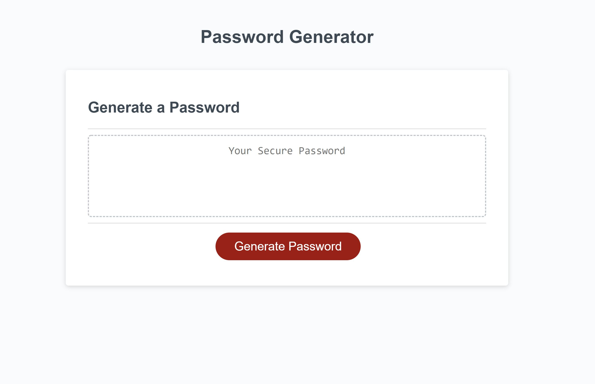

Homework #3: Password Generator by Cristino Perez (https://github.com/cperez525)

Repository URL: https://github.com/cperez525/password_generator

Deployed App URL: https://cperez525.github.io/password_generator/

Need a randomized password to keep your accounts protected? Look no further than the Password Generator! Follow the prompts to customize aspects about your password such as what kind of characters you want to include or the password length, click the Generate Password button, and get your new secure password.

This application was developed using HTML, CSS, and Javascript.

Screenshots:

1) Password Generator Page (default)-  

2) Password Generator Page w/ generated password - 

